# Assignment Report
## Team 4

---

## Table of Contents

1. [Dataset Overview](#1-dataset-overview)
2. [Part 1 — The Dimensionality Crisis (FFN)](#2-part-1--the-dimensionality-crisis-ffn)
3. [Part 2 — The CNN Baseline](#3-part-2--the-cnn-baseline)
4. [Part 3 — MobileNet & Efficiency (Depthwise Separable Convolutions)](#4-part-3--mobilenet--efficiency)
5. [Part 4 — The Detection Sprint (BCCD Medical Imaging)](#5-part-4--the-detection-sprint-bccd)
6. [Final Comparison Table](#6-final-comparison-table)
7. [Key Conclusions](#7-key-conclusions)

---

## 1. Dataset Overview

### CIFAR-10 (Parts 1–3)

| Property | Value |
|---|---|
| Training samples | 50,000 |
| Test samples | 10,000 |
| Image size | 32 × 32 × 3 (RGB) |
| Classes | 10 (airplane, automobile, bird, cat, deer, dog, frog, horse, ship, truck) |
| Pixel range | 0 – 255 (uint8) |
| Per-channel mean (R/G/B) | 125.31 / 122.95 / 113.87 |
| Per-channel std (R/G/B) | 62.99 / 62.09 / 66.70 |

- The class distribution is **perfectly balanced** — 5,000 training and 1,000 test samples per class.
- Training augmentation: `RandomHorizontalFlip` + normalization with CIFAR-10 channel statistics.

**Figure 1 — CIFAR-10 Class Distribution (Train vs Test)**

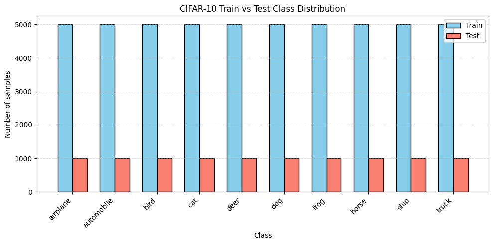

**Figure 2 — Sample Images from Each Class (Train row & Test row)**

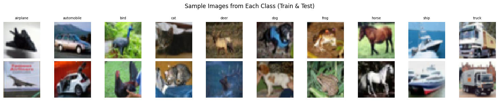

---

### BCCD Blood Cell Dataset (Part 4)

| Property | Value |
|---|---|
| Total samples | 364 images |
| Train / Val split | 291 / 73 (80/20) |
| Image size (resized) | 96 × 96 |
| Classes | 3 (RBC, WBC, Platelets) |
| Annotation format | Pascal VOC XML (bounding boxes) |

**Class Distribution (BCCD — Dominant Object per Image):**

| Class | Count |
|---|---|
| WBC (White Blood Cells) | 344 |
| RBC (Red Blood Cells) | 17 |
| Platelets | 3 |

> The dataset is **heavily imbalanced** — WBC dominates ~94.5% of images, which directly affects model performance and explains the high classification accuracy (model can safely bias toward WBC).

---

## 2. Part 1 — The Dimensionality Crisis (FFN)

### 2.1 Architecture

A 3-layer Feedforward Network (FFN) with 512 hidden units per layer, trained on CIFAR-10:

```
Input (3 × 32 × 32) → Flatten (3072)
→ Linear(3072, 512) → ReLU
→ Linear(512, 512)  → ReLU
→ Linear(512, 10)   → [CrossEntropyLoss]
```

### 2.2 Parameter Count (Manual Derivation)

| Layer | Weights | Bias | Total |
|---|---|---|---|
| Layer 1: 3072 → 512 | 3,072 × 512 = 1,572,864 | 512 | **1,573,376** |
| Layer 2: 512 → 512 | 512 × 512 = 262,144 | 512 | **262,656** |
| Layer 3: 512 → 10 | 512 × 10 = 5,120 | 10 | **5,130** |
| **TOTAL** | | | **1,841,162** |

Verified with PyTorch: `sum(p.numel() for p in ffn.parameters()) = 1,841,162`

### 2.3 Training Results (5 Epochs, Adam lr=1e-3)

| Epoch | Train Loss | Train Acc | Val Acc |
|---|---|---|---|
| 1 | 1.6414 | 41.82% | 46.62% |
| 2 | 1.4489 | 48.55% | 50.31% |
| 3 | 1.3195 | 53.53% | 52.52% |
| 4 | 1.1892 | 58.06% | 54.87% |
| 5 | 1.0835 | 61.89% | **56.78%** |

**Figure 3 — FFN Training Loss & Accuracy Curves**

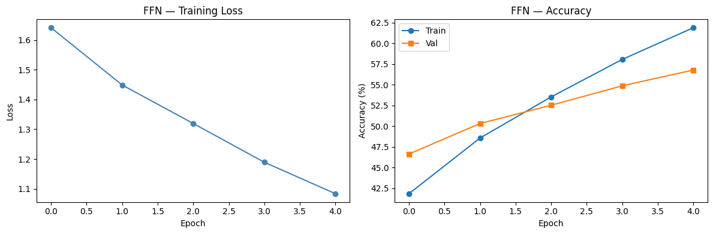

### 2.4 Translation Sensitivity Analysis

**Why FFNs Fail with Translation:**
An FFN flattens the 2D image into a 1D vector. Every pixel maps to a **unique, fixed weight**. A 4-pixel right shift reassigns pixel values to different input indices, fundamentally changing the activation pattern across all 3,072 inputs. FFNs have **zero translation invariance** because weights are position-specific, not shared spatially.

#### Single-Image Test (Sample: "cat")

| | Prediction | Confidence |
|---|---|---|
| Original | cat | 32.31% |
| 4-px right shifted | cat | 33.20% |
| Confidence delta | — | 0.89% |

> Note: This single image happened to maintain its prediction, but this is coincidental. The full test-set analysis below reveals the true vulnerability.

**Figure 4 — FFN Translation Sensitivity (Single Image: Original vs 4-px Shifted)**

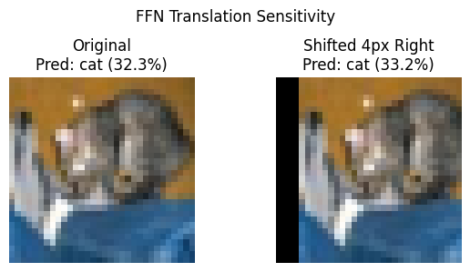

#### Full Test Set Analysis (10,000 images)

| Metric | Original | 4-px Shifted | Change |
|---|---|---|---|
| Loss | 1.2443 | 2.2669 | **+0.82** |
| Accuracy | 56.78% | 29.54% | **−27.24%** |

#### 100-Sample Confidence Analysis (Originally Correct Predictions)

| Metric | Value |
|---|---|
| Avg confidence — original (correct preds) | 64.66% |
| Avg confidence — shifted (same samples) | 23.31% |
| Confidence drop | **−41.35%** |
| Samples counted | 63 / 100 |

**Figure 5 — FFN Full Translation Sensitivity (Accuracy & Confidence Bar Charts)**

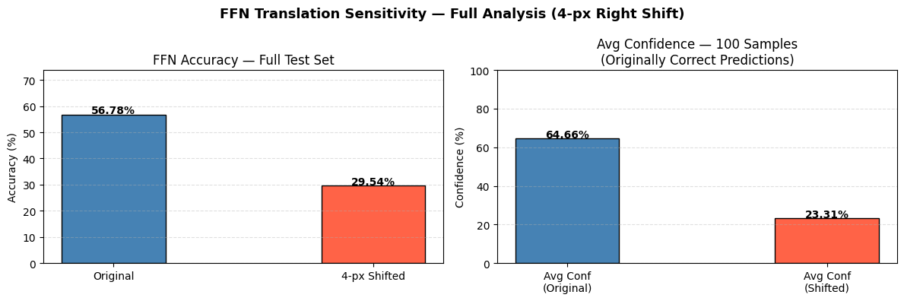

#### Interpretation

A 4-pixel shift causes a **27.24% accuracy drop** (from 56.78% to 29.54%) — nearly halving the model's performance. The confidence drop of 41.35% further demonstrates that the FFN is catastrophically disrupted by minor spatial changes that a human would consider imperceptible.

---

## 3. Part 2 — The CNN Baseline

### 3.1 Custom CNN Architecture

```
Input (3, 32, 32)
→ Conv2d(3→32,  k=3, stride=1, no padding) → ReLU  → (32, 30, 30)
→ Conv2d(32→64, k=3, stride=1, no padding) → ReLU  → (64, 28, 28)
→ Conv2d(64→128,k=3, stride=1, no padding) → ReLU  → (128, 26, 26)
→ GlobalAveragePooling                              → (128, 1, 1)
→ Flatten                                           → (128,)
→ Linear(128, 1024) → ReLU
→ Linear(1024, 1024) → ReLU
→ Dropout(0.3)
→ Linear(1024, 512) → ReLU
→ Linear(512, 10)
```

**Total Parameters:** 1,804,874

### 3.2 ResNet-18 (Fine-tuned)

- Pre-trained on ImageNet (ResNet18_Weights.IMAGENET1K_V1)
- Final FC layer replaced: `Linear(512, 10)` for CIFAR-10
- **Total Parameters:** 11,181,642

### 3.3 Training Results (10 Epochs)

#### Custom CNN (Adam lr=1e-3, Cosine Annealing)

| Epoch | Train Loss | Train Acc | Val Acc |
|---|---|---|---|
| 1 | 1.7830 | 29.71% | 38.06% |
| 3 | 1.3000 | 51.87% | 55.45% |
| 5 | 1.0723 | 61.00% | 62.21% |
| 7 | 0.9376 | 66.45% | 65.34% |
| 10 | 0.8284 | 70.43% | **68.01%** |

#### ResNet-18 Fine-tuned (Adam lr=5e-4, Cosine Annealing)

| Epoch | Train Loss | Train Acc | Val Acc |
|---|---|---|---|
| 1 | 0.8536 | 70.89% | 77.95% |
| 3 | 0.4401 | 85.03% | 81.39% |
| 5 | 0.2788 | 90.58% | 84.68% |
| 7 | 0.1443 | 95.23% | 85.23% |
| 10 | 0.0450 | 98.68% | **86.57%** |

**Figure 6 — Custom CNN vs ResNet-18: Accuracy & Loss Curves**

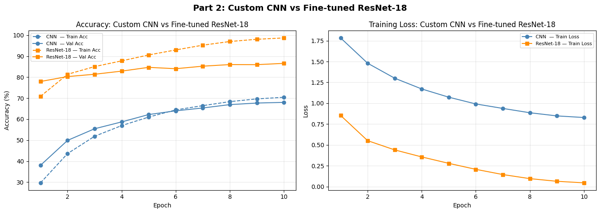

### 3.4 Analysis

| Model | Val Accuracy | Parameters |
|---|---|---|
| Custom CNN | 68.01% | 1,804,874 |
| ResNet-18 (Fine-tuned) | **86.57%** | 11,181,642 |
| Improvement | **+18.56%** | — |

**Why ResNet-18 performs better:**
- Pre-trained ImageNet weights provide rich low-level features (edges, textures, gradients) learned from 1.2M images.
- These features generalize effectively to CIFAR-10 even though images are only 32×32.
- ResNet-18 starts epoch 1 at 77.95% val accuracy — already far ahead of the custom CNN's final performance.
- The custom CNN, trained from scratch on only 50K images, struggles to learn sufficiently discriminative features.

---

## 4. Part 3 — MobileNet & Efficiency

### 4.1 Depthwise Separable Convolution (DSC)

**Standard Convolution:**
- Operation: K × K × C_in × C_out
- For K=3, C_in=128, C_out=256: `3 × 3 × 128 × 256 + 256 = 295,168` parameters

**Depthwise Separable Convolution:**
- **Depthwise:** K × K × C_in (one filter per input channel)
- **Pointwise:** 1 × 1 × C_in × C_out (mix channels)
- For K=3, C_in=128, C_out=256: `(3×3×128) + (1×1×128×256) = 1,152 + 32,768 = 33,920` parameters

#### Mathematical Comparison (K=3, C_in=128, C_out=256)

| Type | Weights | Bias | Total |
|---|---|---|---|
| Standard Conv | 294,912 | 256 | **295,168** |
| Depthwise (DW) | 1,152 | 0 | 1,152 |
| Pointwise (PW) | 32,768 | 0 | 32,768 |
| **DSC Total** | **33,920** | **0** | **33,920** |

**Parameter Reduction: 295,168 → 33,920 = 88.51% reduction**

Theoretical ratio: `1/C_out + 1/K² = 0.0039 + 0.1111 = 0.1150` (i.e., DSC uses ~11.5% of standard conv parameters)

### 4.2 MobileCNN Architecture

```
Input (3, 32, 32)
→ DepthwiseSepConv(3 → 32)  → MaxPool2d(2)   → (32, 16, 16)
→ DepthwiseSepConv(32 → 64) → MaxPool2d(2)   → (64, 8, 8)
→ DepthwiseSepConv(64 → 128)                 → (128, 8, 8)
→ GlobalAveragePooling                        → (128,)
→ Linear(128, 10)
```

**Total Parameters:** 13,163

### 4.3 Training Results (10 Epochs, Adam lr=1e-3)

| Epoch | Train Loss | Train Acc | Val Acc |
|---|---|---|---|
| 1 | 1.6783 | 38.67% | 48.18% |
| 3 | 1.2431 | 55.44% | 56.88% |
| 5 | 1.1350 | 59.34% | 60.73% |
| 7 | 1.0869 | 61.39% | 61.44% |
| 10 | 1.0515 | 62.67% | **62.41%** |

**Figure 7 — Custom CNN vs MobileCNN: Validation Accuracy**

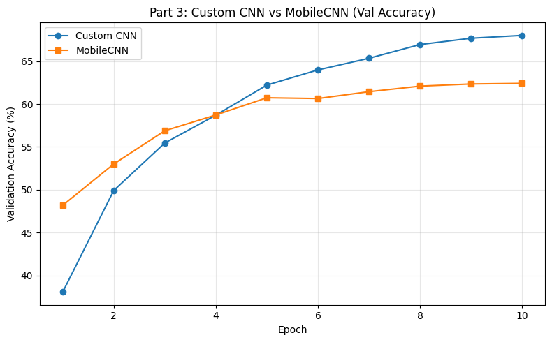

### 4.4 Efficiency Analysis

| Model | Parameters | Model Size | Val Acc |
|---|---|---|---|
| Custom CNN | 1,804,874 | 6.890 MB | 68.01% |
| MobileCNN | **13,163** | **0.065 MB** | 62.41% |
| Reduction | **99.3% fewer params** | **99.1% smaller** | −5.60% |

**Key Insight:** MobileCNN achieves 62.41% accuracy with only 13,163 parameters (0.065 MB) — a remarkable efficiency. The accuracy drop of ~5.6% vs. the Custom CNN is a small price for a model that is **137× smaller** on disk and **99.3% more parameter-efficient**. This makes DSC-based models ideal for edge deployment (mobile phones, embedded systems).

---

## 5. Part 4 — The Detection Sprint (BCCD)

### 5.1 Task Setup

- **Dataset:** BCCD (Blood Cell Count and Detection)
- **Task:** Single-class blood cell detection — classify cell type + localize with bounding box
- **Strategy:** For each image, the **largest bounding box** is selected as the primary target (single-object detection simplification)
- **BBox format:** `[x_center, y_center, width, height]` normalized to [0, 1] (Pascal VOC → YOLO-style)

**Figure 8 — BCCD Dataset Sample Images (Green = Ground-Truth BBox)**

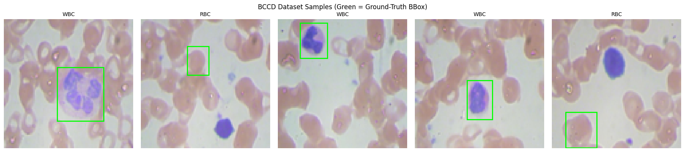

### 5.2 MobileDetNet Architecture (Dual-Head)

```
Input (3, 96, 96)
→ DepthwiseSepConv(3→32)   + MaxPool2d(2)  → (32, 48, 48)
→ DepthwiseSepConv(32→64)  + MaxPool2d(2)  → (64, 24, 24)
→ DepthwiseSepConv(64→128) + MaxPool2d(2)  → (128, 12, 12)
→ DepthwiseSepConv(128→256)                → (256, 12, 12)
→ GlobalAveragePooling                     → (256,)
        ↙                      ↘
Classification Head         Regression Head
Linear(256→128) + ReLU + Dropout(0.3)   Linear(256→128) + ReLU + Dropout(0.3)
Linear(128→3)                           Linear(128→4) + Sigmoid
[CrossEntropyLoss]                      [MSE Loss, output in (0,1)]
```

**Total Parameters:** 113,256

### 5.3 Loss Function

**Joint Loss:**
```
L_total = CrossEntropy(cls_output, labels) + MSE(reg_output, gt_bbox)
```

- **CrossEntropy** handles multi-class blood cell classification (RBC/WBC/Platelets)
- **MSE** regresses bounding box coordinates — Sigmoid ensures outputs stay in [0, 1]
- Both losses are equally weighted (λ = 1)

### 5.4 Training Results (25 Epochs, Adam lr=1e-3, Cosine Annealing)

| Epoch | Total Loss | CE Loss | MSE Loss | Cls Acc | Val mIoU |
|---|---|---|---|---|---|
| 1 | 0.4424 | 0.4167 | 0.0257 | 93.5% | 0.1767 |
| 5 | 0.1924 | 0.1696 | 0.0229 | 94.5% | 0.1592 |
| 10 | 0.1067 | 0.0855 | 0.0212 | 94.8% | 0.1732 |
| 15 | 0.0560 | 0.0359 | 0.0201 | 99.0% | 0.1763 |
| 20 | 0.0998 | 0.0786 | 0.0212 | 99.0% | 0.1817 |
| 25 | 0.0485 | 0.0284 | 0.0201 | 99.0% | 0.1786 |

**Figure 9 — Detection Training: Loss Curves & Validation mIoU**

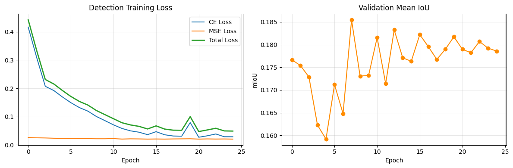

### 5.5 Final Detection Evaluation (Validation Set — 73 samples)

| Metric | Value |
|---|---|
| Classification Accuracy | **94.52%** |
| Mean IoU (mIoU) | **0.1786** |
| Median IoU | 0.1085 |
| IoU > 0.5 (good detections) | 7/73 (**9.6%**) |

**Figure 10 — BCCD Detection Results (Green = Ground Truth | Red = Predicted)**

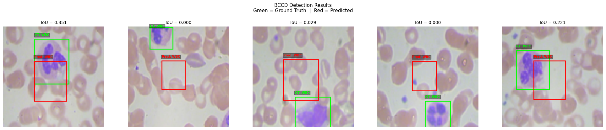

### 5.6 Analysis & Discussion

**Classification (94.52% accuracy):**
The high classification accuracy is partly attributable to the severe class imbalance — WBC comprises ~94.5% of the dataset. The model essentially learns to predict WBC for most images. Despite this, the backbone extracts meaningful features given the compact model size (113K parameters).

**Localization (mIoU = 0.1786):**
- The IoU score is relatively low, which is expected for a simplified single-box detector without anchor boxes, NMS, or feature pyramid networks.
- Only 9.6% of predictions achieve IoU > 0.5, which is the standard "good detection" threshold.
- The MSE loss stagnates around 0.020 across all epochs, indicating the regression head converges to a "safe average" box prediction rather than precise localization.
- **Root cause:** Without anchor priors or spatial attention, the regression head struggles to learn precise localization from only 291 training images.

**Improvement paths:**
- Use Smooth L1 (Huber) loss instead of MSE for regression
- Implement class-weighted sampling to handle imbalance
- Add anchor boxes or use an anchor-free detection head (FCOS-style)
- Increase training data with augmentation (random crop, color jitter)

---

## 6. Final Comparison Table

| Model | Parameters | Val Acc | Model Size | Mean IoU |
|---|---|---|---|---|
| Part 1: FFN | 1,841,162 | 56.78% | N/A | N/A |
| Part 2: Custom CNN | 1,804,874 | 68.01% | 6.890 MB | N/A |
| Part 2: ResNet-18 (Fine-tuned) | 11,181,642 | 86.57% | N/A | N/A |
| Part 3: MobileCNN | 13,163 | 62.41% | 0.065 MB | N/A |
| Part 4: MobileDetNet | 113,256 | 94.52%* | 0.453 MB | 0.1786 |

*Classification accuracy on BCCD val set (heavily WBC-biased)

**Figure 11 — Summary Comparison Table (All Models)**

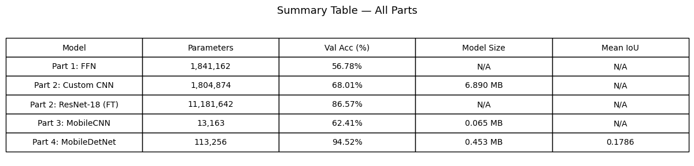

---

## 7. Key Conclusions

### 7.1 FFN vs CNN (Spatial Inductive Bias)

Flattening an image into a 1D vector destroys spatial relationships. An FFN's position-specific weights make it **highly sensitive to translation** — a mere 4-pixel shift drops accuracy from 56.78% to 29.54% (−27.24%). CNNs avoid this by using **shared convolutional filters** that slide across the image, building in translation equivariance by design.

### 7.2 Transfer Learning Advantage

Fine-tuning a pre-trained ResNet-18 delivers **86.57% accuracy** — an 18.56% improvement over the custom CNN trained from scratch. Pre-training on ImageNet (1.2M images, 1,000 classes) teaches universally useful visual features. Even on the small 32×32 CIFAR-10 images, these features transfer effectively, demonstrating that **transfer learning is one of the highest-leverage techniques** in practical deep learning.

### 7.3 Efficiency via Depthwise Separable Convolutions

Replacing standard 3×3 convolutions with DSC reduces parameters by **88.51%** (for K=3, Cin=128, Cout=256). The MobileCNN achieves **62.41% accuracy with just 13,163 parameters** (0.065 MB), versus 68.01% for the Custom CNN with 1.8M parameters. The **accuracy-efficiency tradeoff is highly favorable**: 99.3% fewer parameters for only 5.6% accuracy drop makes DSC the backbone of choice for edge deployment.

### 7.4 Joint Detection Training

The dual-head `MobileDetNet` demonstrates that a single lightweight backbone can simultaneously learn to:
1. **Classify** blood cells (94.52% accuracy)
2. **Localize** cells via bounding box regression (mIoU = 0.1786)

Using a joint loss `L = CE + MSE` is a clean, effective approach. The Sigmoid activation on the regression head elegantly constrains box coordinates to [0, 1] without additional post-processing. The main limitation is the low localization accuracy, attributable to dataset imbalance, small training set (291 images), and absence of anchor-based or multi-scale detection.

### 7.5 Summary of Design Principles Demonstrated

| Principle | Demonstrated By |
|---|---|
| Spatial inductive bias matters | FFN (56.78%) << CNN (68.01%) |
| Transfer learning > training from scratch | ResNet-18 FT (86.57%) >> Custom CNN (68.01%) |
| DSC enables efficient models | MobileCNN: 99.3% fewer params, −5.6% accuracy |
| Multi-task learning works | Joint CE+MSE loss for simultaneous cls + detection |
| Compact models for medical imaging | MobileDetNet: 113K params, 0.453 MB |

---

*Report prepared by Team 4 | IITH M.Tech Deep Learning Assignment*
